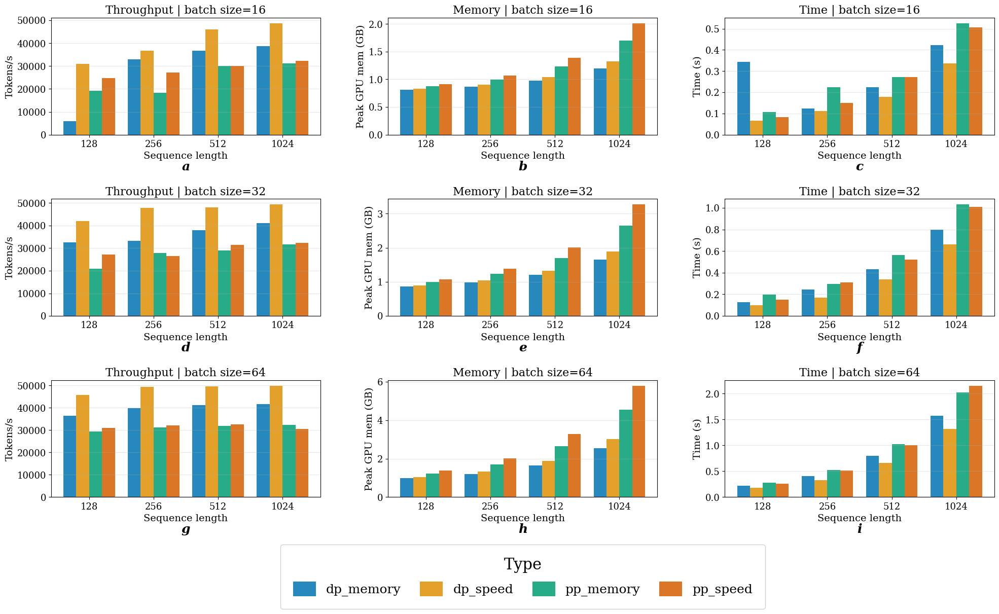
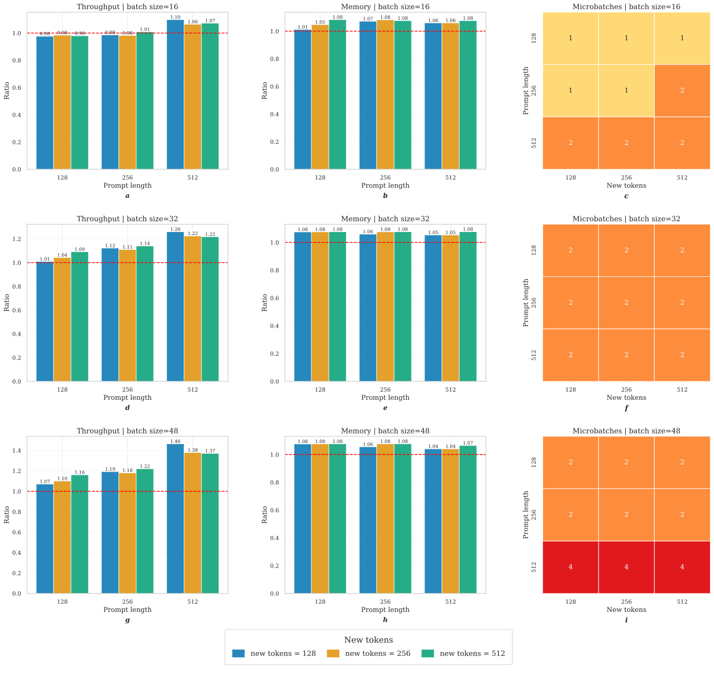
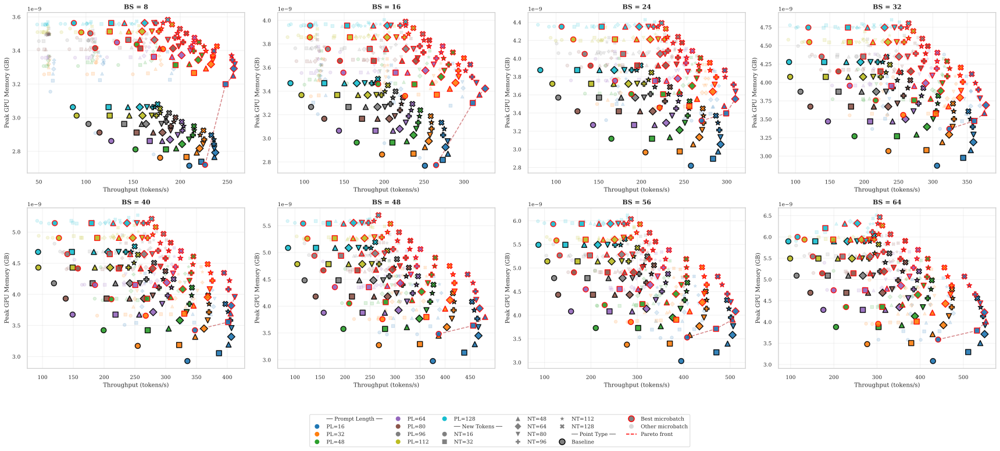

# Parallelism in Transformers: My Implementation

**Тема ВКР:** Оптимизация распределённого инференса больших языковых моделей с архитектурой Mixture of Experts

### На данный момент реализовано три типа параллелизма:
 1. Tensor Parallel
 2. Pipeline Parallel с microbatch (2.0) и возможностью использования с Tensor Parallel
 3. MoE Parallel с возможностью использования с Data Parallel

 ## Эксперименты

### Сравнение реализации тензорного параллелизма с разными разбиениями с DeepSpeed
| Параметр                                 | DeepSpeed      | New partitionig      | Standard Partitioning      |
|------------------------------------------|--------------------|--------------------|--------------------|
| **Время инференса (s)**                  | 592.807            | 1988.417           | 757.441            |
| **Пропускная способность (token/s)**     | 4.750              | 1.416              | 3.718              |
| **Макс. память на устройство (генератор, ГБ)** | device 0: 2.706 device 1: 2.706 | device 0: 2.651 device 1: 2.651 | device 0: 2.651 device 1: 2.651 |
| **Макс. память на устройство (инференс, ГБ)** | device 0: 3.400 device 1: 3.400 | device 0: 3.333 device 1: 3.333 | device 0: 4.331 device 1: 4.331 |
| **Макс. память на устройство (общая, ГБ)**   | device 0: 3.400 device 1: 3.400 | device 0: 3.333 device 1: 3.333 | device 0: 4.331 device 1: 4.331 |

### Реализация конвейерного параллелизма 1.0 c синхронными и асинхронными коллективными операциями

| Параметр                                 | Sync     | Async      | 
|------------------------------------------|----------|------------|
| **Время инференса (с)**                  | 6.875    | 6.844      | 
| **Пропускная способность (token/s)**     | 13.964   | 14.026     | 
| **Макс. память на устройство (генератор, ГБ)** | device 0: 2.650 device 1: 2.635 | device 0: 2.650 device 1: 2.635 | 
| **Макс. память на устройство (инференс, ГБ)** | device 0: 2.827 device 1: 2.812 | device 0: 3.934 device 1: 3.917 | 
| **Макс. память на устройство (общая, ГБ)**   | device 0: 2.827 device 1: 2.812 | device 0: 3.934 device 1: 3.917 |

### Сравнение реализаций тензорного и конвейерного параллелизма с DeepSpeed

| Параметр                                 | DeepSpeed      | New partitionig      | Standard Partitioning      | Pipeline |
|------------------------------------------|----------------|----------------------|---------------------------|----------|
| **Время инференса (s)**                  | 592.807        | 1988.417             | 757.441                   | 651.239  |
| **Пропускная способность (token/s)**     | 4.750          | 1.416                | 3.718                     | 4.717    |
| **Макс. память на устройство (генератор, ГБ)** | device 0: 2.706 device 1: 2.706 | device 0: 2.651 device 1: 2.651 | device 0: 2.651 device 1: 2.651 | device 0: 2.650 device 1: 2.635 |
| **Макс. память на устройство (инференс, ГБ)** | device 0: 3.400 device 1: 3.400 | device 0: 3.333 device 1: 3.333 | device 0: 4.331 device 1: 4.331 | device 0: 3.407 device 1: 3.391 |
| **Макс. память на устройство (общая, ГБ)**   | device 0: 3.400 device 1: 3.400 | device 0: 3.333 device 1: 3.333 | device 0: 4.331 device 1: 4.331 | device 0: 3.407 device 1: 3.391 |

### Реализация конвейерного параллелизма 2.0 с микробатчами

| **Версия pipeline параллелизма** | **2.0** | **2.0** | **2.0** | **2.0** | **1.0** |
|:--------------------------------:|:-------:|:-------:|:-------:|:-------:|:-------:|
| **Размер батча/число потоков**   | 1/64    | 4/16    | 8/8     | 64/1    | -    |
| **Время работы forward (s)**     | 8.255   | 7.811   | 11.021  | 13.975  | 13.593  |
| **Макс. память на устройство (GB)** | GPU1: 6.198 GPU2: 6.222 | GPU1: 5.854 GPU2: 5.838 | GPU1: 5.798 GPU2: 5.782 | GPU1: 5.852 GPU2: 5.836 | GPU1: 5.852 GPU2: 5.836 |

### Сравнение MoE параллелзма по данными и "конвейерного" MoE параллелизма

### Сравнение конвейерного параллелзма 1.0 и 2.0 при generate на opt-2.7b

