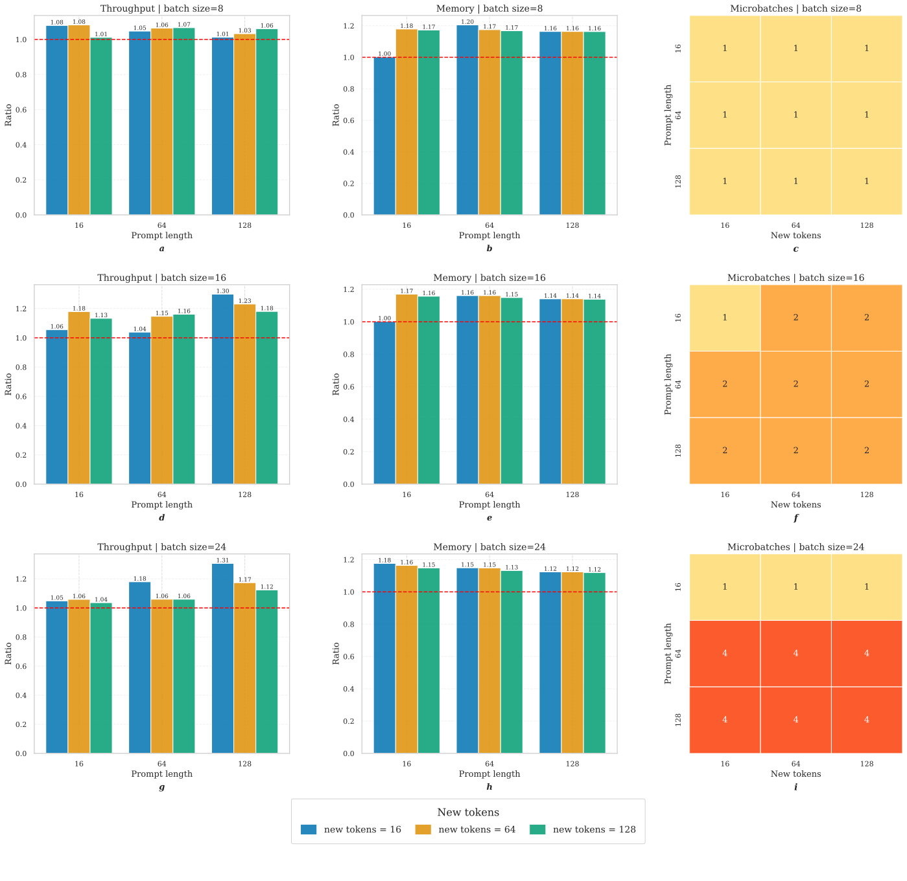
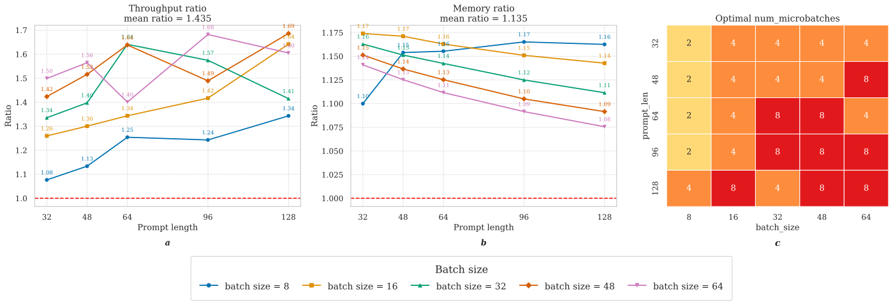
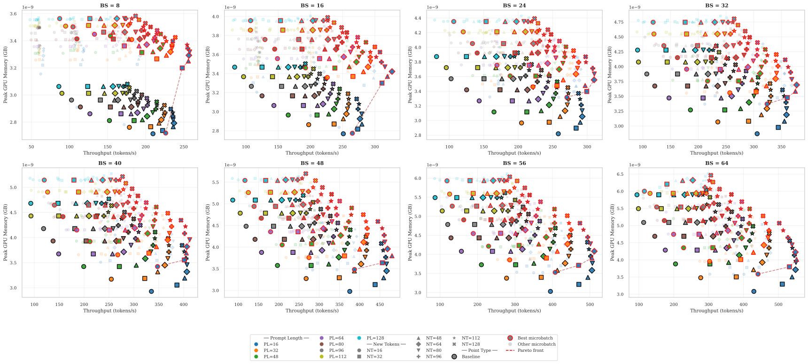

# Parallelism in Transformers: My Implementation

**Тема ВКР:** Оптимизация распределённого инференса больших языковых моделей с архитектурой Mixture of Experts

### На данный момент реализовано три типа параллелизма:
 1. Tensor Parallel
 2. Pipeline Parallel с microbatch (2.0) и возможностью использования с Tensor Parallel
 3. MoE Parallel с возможностью использования с Data Parallel

 ## Эксперименты

### Сравнение реализаций тензорного и конвейерного параллелизма с DeepSpeed

| Параметр                                 | DeepSpeed      | New partitionig      | Standard Partitioning      | Pipeline |
|------------------------------------------|----------------|----------------------|---------------------------|----------|
| **Время инференса (s)**                  | 592.807        | 1988.417             | 757.441                   | 651.239  |
| **Пропускная способность (token/s)**     | 4.750          | 1.416                | 3.718                     | 4.717    |
| **Макс. память на устройство (генератор, ГБ)** | device 0: 2.706 device 1: 2.706 | device 0: 2.651 device 1: 2.651 | device 0: 2.651 device 1: 2.651 | device 0: 2.650 device 1: 2.635 |
| **Макс. память на устройство (инференс, ГБ)** | device 0: 3.400 device 1: 3.400 | device 0: 3.333 device 1: 3.333 | device 0: 4.331 device 1: 4.331 | device 0: 3.407 device 1: 3.391 |
| **Макс. память на устройство (общая, ГБ)**   | device 0: 3.400 device 1: 3.400 | device 0: 3.333 device 1: 3.333 | device 0: 4.331 device 1: 4.331 | device 0: 3.407 device 1: 3.391 |

### Сравнение конвейерного параллелзма 1.0 и 2.0 при generate на opt-1.3b

### Задачи, которые необходимо решить с MoE

1. Что-то придумать с расписанием, во первых увеличить долю перекрытий, во вторых по сути мы сейчас только контролируем передачи, возможно, стоит контролироваться еще и вычисления
2. Разобраться, почему она так много кушает памяти
3. Нужно переработать код для всех типов параллелизма, чтобы они нормально могли взаимодействовать вместе
4. Переделать механизм работы с расписанией, можно оставить многопоточность, но отправлять именно в какую-то очередь передачи, где они будут выполняться по одной. Это все еще должно быть статическим расписаснием. А можно ли его избедать? То есть отказаться от threading?

### Гипотезы MoE для проверки

#### 1. Расписание "рекурсивный конвейер"

**Идея:** У нас относительно неплохо RoundRobin работает на двух видеокартах, при этом при увеличении число у нас проихсдоит слишком много синхронизаций, вследствие чего deadlock. Что есть делать Expert parallel только между 2 GPU? И считать их как одну "глобальную" стадию и внутри них будет своя "локальная" стадия

#### 2. Гипотеза "MoE-сжатия"

**Идея:** Сжать-передать-расжать. Единственная прболема состоит в том, как обучить хорошие encoder и decoder. В идеале для каждого делать свой, однако в таком случае задолбаемся учить, следовательно нужно разработать алгоритм, который мог бы этого избежать.

По идее, тоже целесообразно использовать только на стадии prefill

#### 3. Гипотеза "speculative-MoE"

**Идея:** У нас уже есть алгоритм, который снижает долю коммуникаций all-to-all. Однако, он снижает по сути только процентов на 30. А что будет если мы все же объеденим нужные эксперты в кластеры и попытаемся с ними поработать?

надо добавить к оптимизации: редукция MoE трафика

#### 4. Гипотеза "оптимизированный scatter-gather"

**Идея:** Сейчас pipeline-MoE по сути не получился из-за того, что нужно выделять доп буферы, что серьезно бьет по памяти. Можно ли как-то написать оптемизированные операции, которые могут помочь решить эту пробему

Стоит отметить, что на стадии decode в MoE слоях у нас по сути получается то, что сам батч занимает очень мало: [b,1,h], то есть по сути b*h*2. При b = 256 и h = 4096 это примерно 2 мегабайта, то есть можно по сути сделать тупо broadcast и потом scatter получить выходные данные. Сложнее состоит ситация с prefill стадией.

#### 5. "Гетерогенная" гипотеза

**Идея:** опускать экспертов на CPU и сделать алгоритм предугадывания, который будет в нужный момент их поднимать. Для более лучшей точности можно попытатся также их объеденить в кластеры.

Кстати, можно попытаться переходить от одной стадии к другой, то есть, например, при prefill будет с кэспертным параллелизмом, а потом просто меням слоем, путем поднятия другого, по память не измениться, так как количество экспертов не изменится, вследствие чего можно попытаться "побороться" за что-нибудь

### 6. Гипотеза "проверщик"

на основе методов ML или формул получить способ моделировать коллективные операции. Затем для инференса будет использоваться одна видеокарта, но данные будут как бы разбиты по нескольким (все выполнит одна видеокарта и замерит время). Чтобы уместить модель, можно опустить некоторые слои, кроме действующего на gpu. Поднимать их и замерять работу. 
Основная проблема потом будет состоять в том, чтобы это представить "в общем виде". То есть, у нас же, к примеру, есть конвейер. По сути, если будет многопоточность, то должны быть перекрытия, как их учесть? Получится ли создать такой "имитатор" распределенного инференса в "общем" виде?

